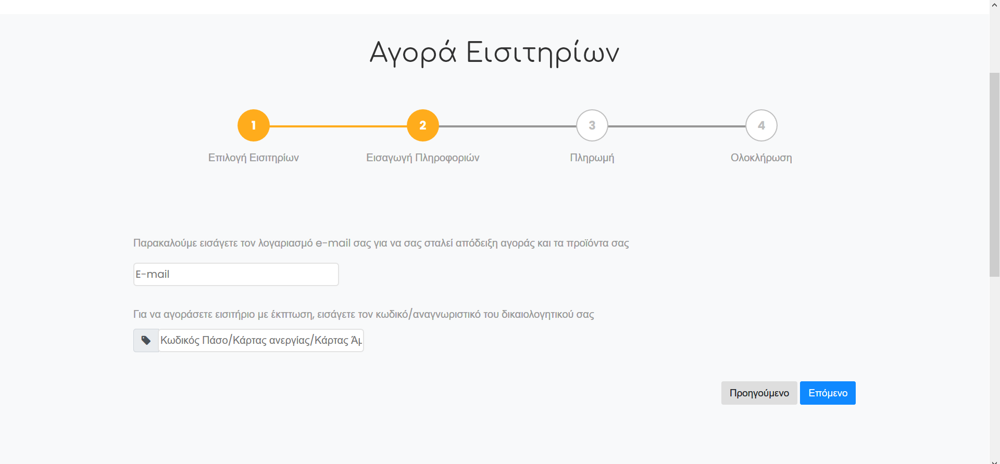
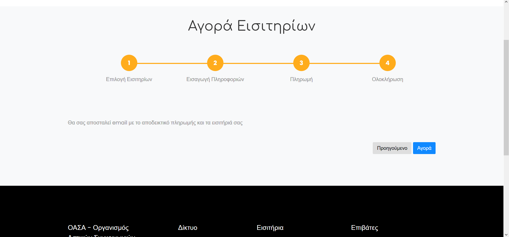

A new, improved website for O.A.S.A. (Athens Public Transport Organization) as part of the project for the Human-Computer Interaction 2019-2020 class.

### Database

Load database/sdi1600077.sql for the creation of the database 
And database/db.sql for data population

To log into the database use
- user: user
- password: password
- schema: sdi1600077

### Improvements

#### Front Page
Users can now easily plan their route using the journey planner, and check the service status of each line, all from the front page

---

#### Line Information
Friendlier interface that allows users to see the details of each line, station, and area of coverage along with a map of the surrounding area

---

#### Ticket Purchase
Users can issue personalized cards, buy tickets and recharge their cards and used tickets from the website, and have them sent to their address or email

---

---

---

---

#### User Accounts
Users can create an account for a more personalized experience

---

#### Interface
General improvement of the interface for increased usability and better overall user experience

## Team
- Maria Karamina
- Georgios Koursiounis
- Vasileios Poulopoulos

## Credits
[Template from Colorlib](https://colorlib.com/wp/template/carbook/)  
[OASA Logo](https://el.wikipedia.org/wiki/%CE%A3%CF%85%CE%B3%CE%BA%CE%BF%CE%B9%CE%BD%CF%89%CE%BD%CE%AF%CE%B5%CF%82_%CF%83%CF%84%CE%B7%CE%BD_%CE%91%CE%B8%CE%AE%CE%BD%CE%B1#/media/%CE%91%CF%81%CF%87%CE%B5%CE%AF%CE%BF:TransportForAthens_logo.jpg)  
Maps and Ticket images from www.oasa.gr
