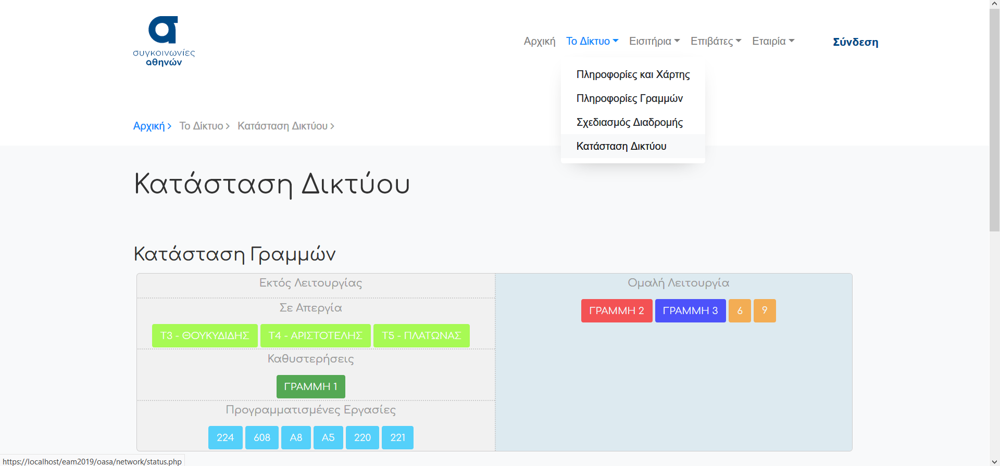
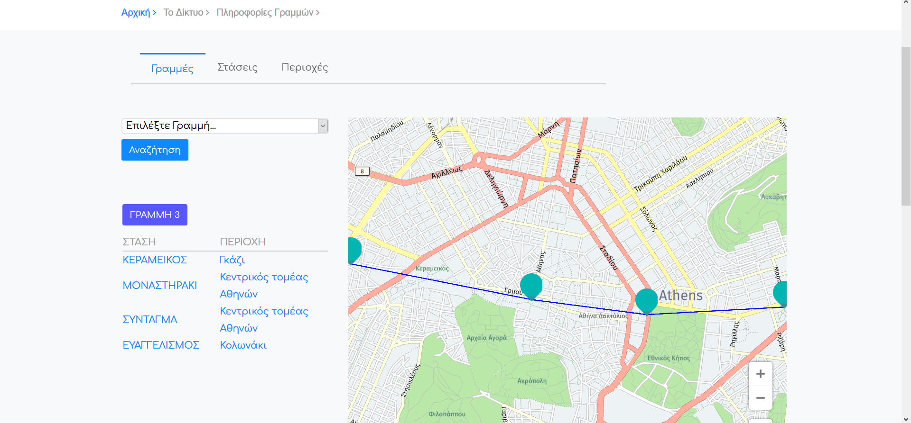
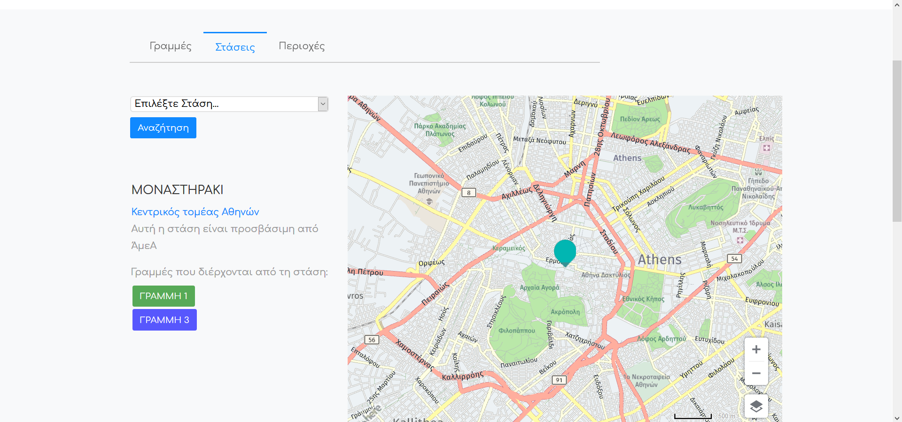
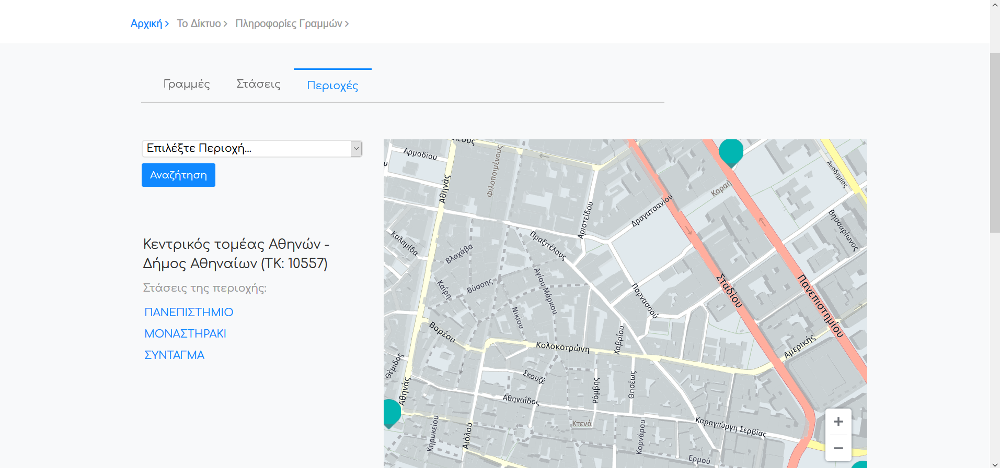
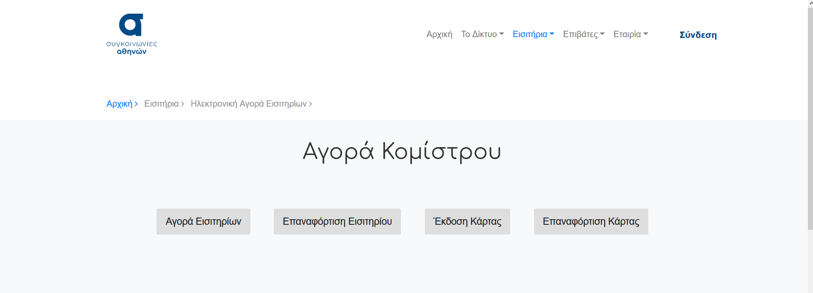
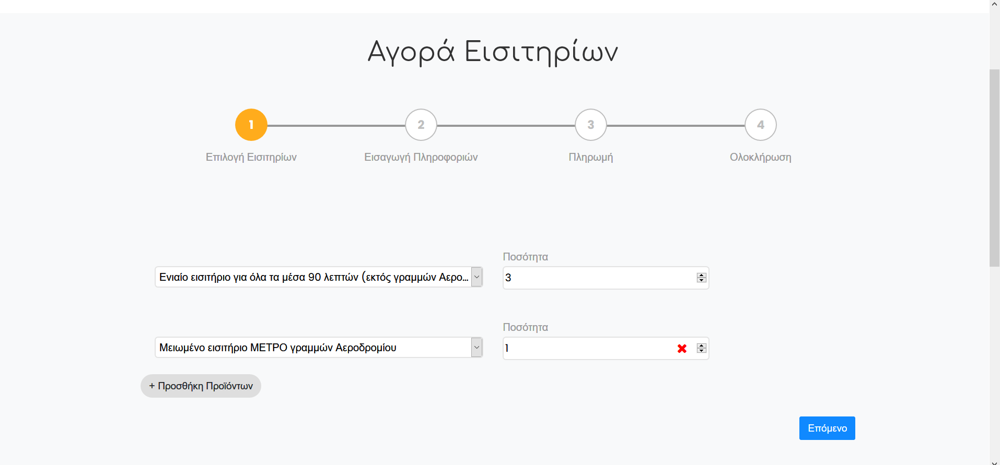
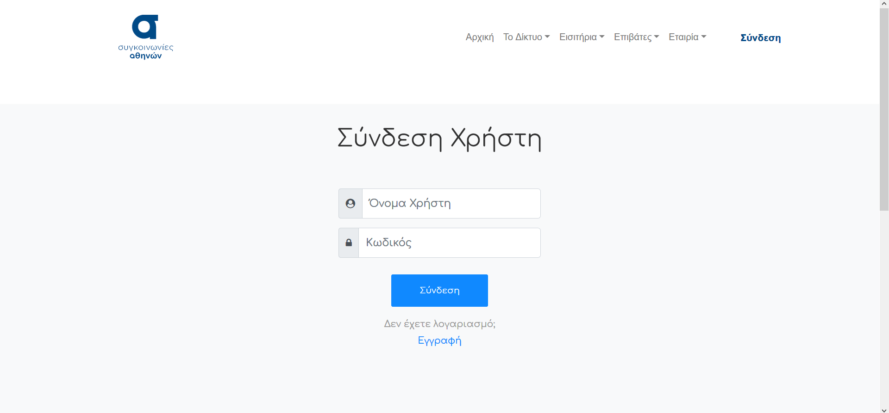
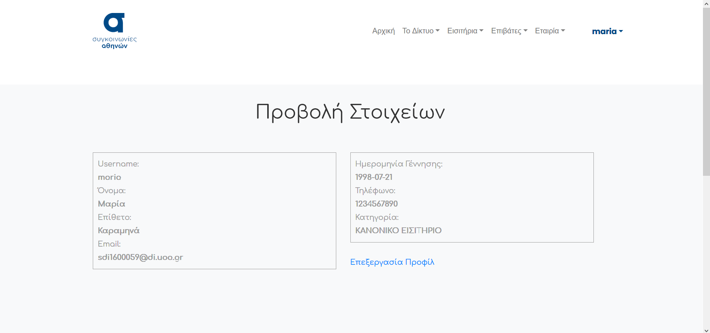

A new, improved website for O.A.S.A. (Athens Public Transport Organization) as part of the project for the Human-Computer Interaction 2019-2020 class.

### Database

Load database/sdi1600077.sql for the creation of the database 
And database/db.sql for data population

To log into the database use
- user: user
- password: password
- schema: sdi1600077

### Improvements

#### Front Page
Users can now easily plan their route using the journey planner, and check the service status of each line, all from the front page
           1               |           2
:-------------------------:|:-------------------------:
 | 

#### Line Information
Friendlier interface that allows users to see the details of each line, station, and area of coverage along with a map of the surrounding area
           1               |           2              |           3
:-------------------------:|:------------------------:|:------------------------:
 |  | 

#### Ticket Purchase
Users can issue personalized cards, buy tickets and recharge their cards and used tickets from the website, and have them sent to their address or email
           1               |           2
:-------------------------:|:-------------------------:
  |  

#### User Accounts
Users can create an account for a more personalized experience
           1               |           2
:-------------------------:|:-------------------------:
 | 

#### Interface
General improvement of the interface for increased usability and better overall user experience
